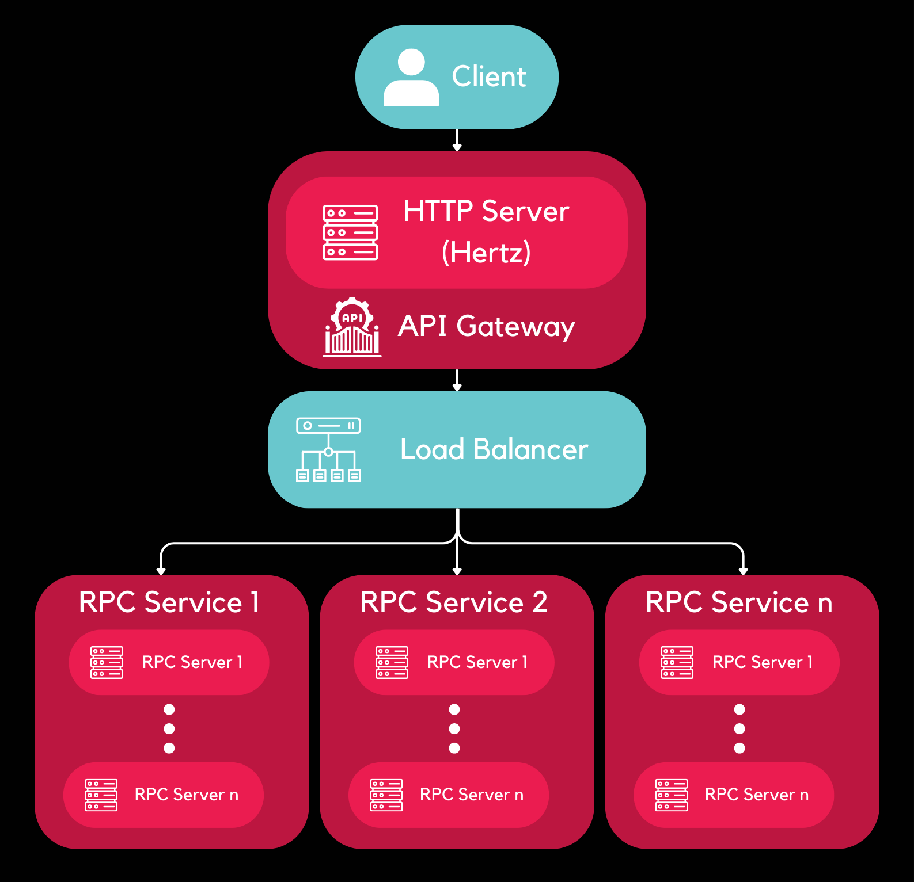

# CloudWeGo API Gateway

This repository contains the code for the implementation of an API Gateway for Orbital 2023.

CloudWeGo API Gateway is an API Gateway based on `CloudWeGo` projects, using technologies, such as `Kitex` - RPC framework,
and `Hertz` - HTTP framework. This API Gateway can handle JSON-encoded HTTP requests and utilize `Kitex`'s Generic-Call feature 
to convert these requests into Thrift binary format. The API Gateway will then route the requests to one of the backend 
RPC servers obtained from the registry center.

## CloudWeGo
[CloudWeGo](https://www.cloudwego.io/) is an open-source middleware set launched by ByteDance that can be used to
quickly build enterprise-class cloud native architectures. It contains many components,
including the RPC framework Kitex, the HTTP framework Hertz, the basic network library
Netpoll, thrfitgo, etc. By combining the community's excellent open source products,
developers can quickly build a complete set of microservices systems.

## Hertz
[Hertz](https://www.cloudwego.io/docs/hertz/) [həːts] is a high-performance, high-usability, extensible HTTP framework for Go. It’s
designed to make it easy for developers to build microservices.
Inspired by other open source frameworks, combined with the unique challenges we met in
ByteDance, Hertz has become production-ready and has powered ByteDance’s internal
services over the years.

## Kitex
[Kitex](https://www.cloudwego.io/docs/kitex/) [kaɪt’eks] is a high-performance and strong-extensibility Golang RPC framework that
helps developers build microservices. If performance and extensibility are the main concerns
when you develop microservices, Kitex can be a good choice.


## Useful Links

- Deployed App (to be added)
- [Milestone I Submission](https://drive.google.com/drive/u/0/folders/1mm--TjLNb5FZXAquGjFT_0S7Nf_3PMf1)
- [Milestone II Submission](https://drive.google.com/drive/folders/1ZqQKP6_HXSqQ5CiKRAptCXUhe7ADz-Yu?usp=drive_link)
- System Design Document (to be added)

## API Gateway Diagram



## Installation

Please install the following to get started with the project:

- [Hertz](https://www.cloudwego.io/docs/hertz/getting-started/)
- [Kitex](https://www.cloudwego.io/docs/kitex/getting-started/)
- [thrift-gen-validator](https://github.com/cloudwego/thrift-gen-validator)
- [etcd](https://github.com/etcd-io/etcd/releases/) for Service Registry (see below for further guide)
- [Postman](https://www.postman.com/downloads/) or [Insomnia](https://insomnia.rest/download) for API testing.

### Installing etcd

- Download the latest version of `etcd` from the [**Releases**](https://github.com/etcd-io/etcd/releases/) page.
- Add the directory to your System's `PATH`. See [**this guide**](https://www.architectryan.com/2018/03/17/add-to-the-path-on-windows-10/) for instructions.

## Getting Started

In the `http-server` directory: `go run .`

In the `rpc-server` directory: `go run .`

In your terminal, run: `etcd --advertise-client-urls http://localhost:7000 --listen-client-urls http://127.0.0.1:7000`

Test with Postman/Insomnia using the following request: `http://127.0.0.1:8080/HelloService/HelloMethod` with the following JSON body:

```json
{
  "Name": "Timothy"
}
```

You should receive the following response:

```json
{
  "RespBody": "hello, Timothy"
}
```

## Adding new services

### IDL

Store your IDL file in the `/idl` directory.
Ensure that your IDL file follows the [Thrift IDL Annotation Standard](https://www.cloudwego.io/docs/kitex/tutorials/advanced-feature/generic-call/thrift_idl_annotation_standards/).

Notes:

- Method name in IDL file is **case-sensitive**.
- Require a type alias as the request and return type.

```thrift
struct EchoReq {
    1:required string message
}

struct EchoResp {
    1: string response
}

service EchoService {
    EchoResp echo(EchoReq) (api.get="/EchoService/echo")
}
```

### Hertz

Navigate to the `http-server` directory and generate the Hertz scaffolding code with the `hz new` command:

```shell
hz new -module "github.com/tim-pipi/cloudwego-api-gateway/http-server" -idl ../idl/[YOUR_IDL_FILE].thrift
go mod tidy
```

Update the logic in `biz/handler/api/[YOUR_IDL_FILE].go` (make the Remote Procedure Call).

### Kitex

Navigate to the `rpc-server` directory and generate the Kitex server scaffolding code with the `kitex` command:

```shell
kitex -module "github.com/tim-pipi/cloudwego-api-gateway/rpc-server" -service hello ../idl/[YOUR_IDL_FILE].thrift
```

Notes:

- The `-service` flag generates the scaffold code for creating a new client and
  server in the `rpc-server` directory.
- `-module` flag generates the `kitex_gen` directory

## Generating From Template

To generate the RPC Server scaffolding code from template, run the following command:

```shell
$ mkdir NEW_DIRECTORY
$ cd NEW_DIRECTORY
$ kitex -module "github.com/tim-pipi/cloudwego-api-gateway/NEW_DIRECTORY" --template-dir
 ../templates --thrift-plugin validator ../idl/hello_api.thrift
go: creating new go.mod: module github.com/tim-pipi/cloudwego-api-gateway/test
Adding apache/thrift@v0.13.0 to go.mod for generated code .......... Done
$ go mod tidy
```

Fill in the handler logic in `handler.go`.

## Updating Services

Run `./update.sh` in the root directory.

If you would like to manually update,

### Updating Hertz

To update the code after changes in the IDL:

```shell
hz update -idl ../idl/[YOUR_IDL_FILE].thrift
```

**Updating Behaviour**:

- No Custom Path:
  - Appends any new code to the **existing file**.
    - If you rename a method, the old method's code remains in the file.
  - Easier to handle
  - Might create duplicated code
- Custom Path
  - Guaranteed "clean code"
  - Reimplement handler logic each time
  - Confusing to keep track of directories after a while

Update the logic in `handler.go`.

### Service Registration and Discovery

Service registration and discovery is done using [etcd](https://etcd.io/docs/v3.5/)
and the [`registry-etcd`](https://github.com/kitex-contrib/registry-etcd) library.
